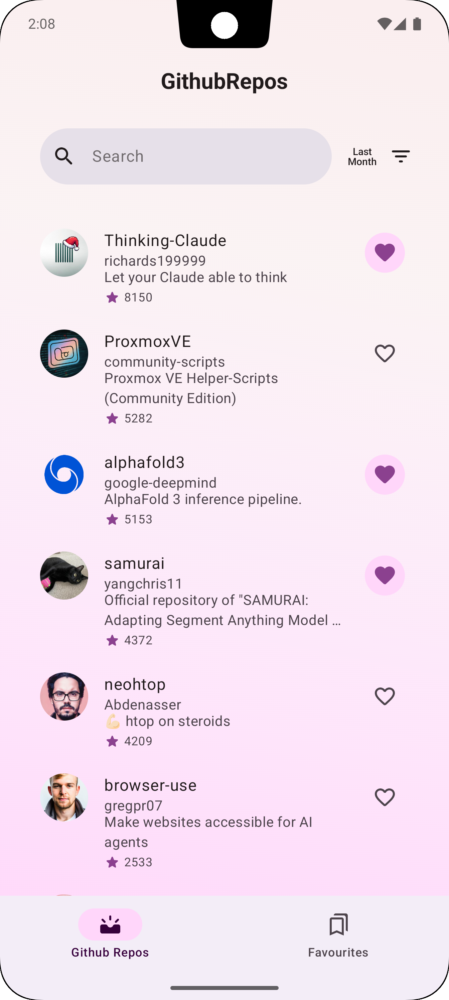
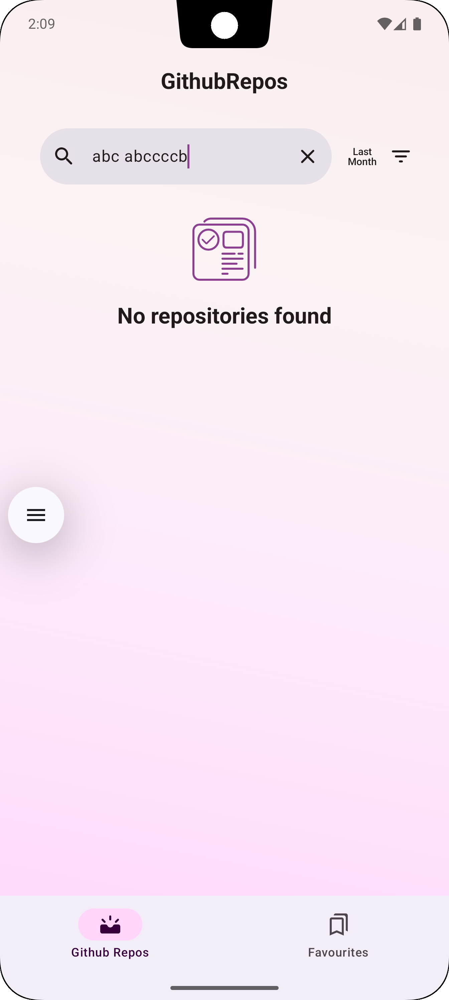
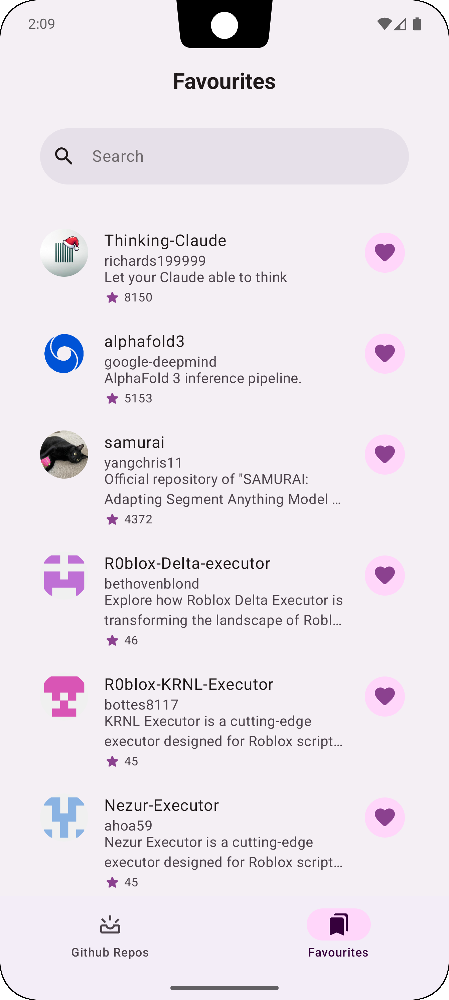
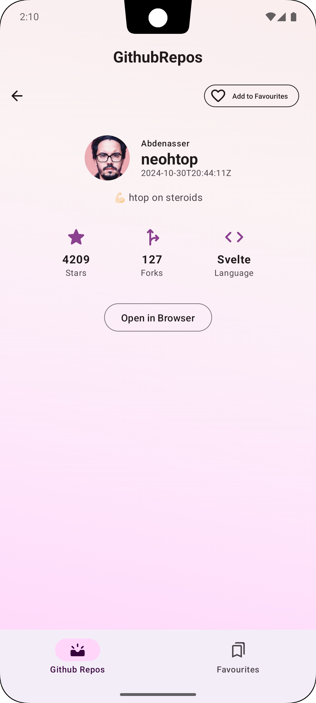
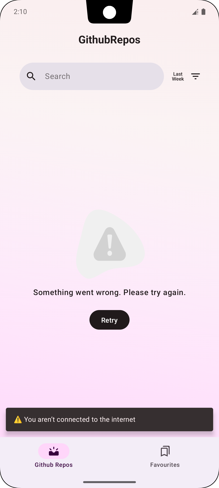
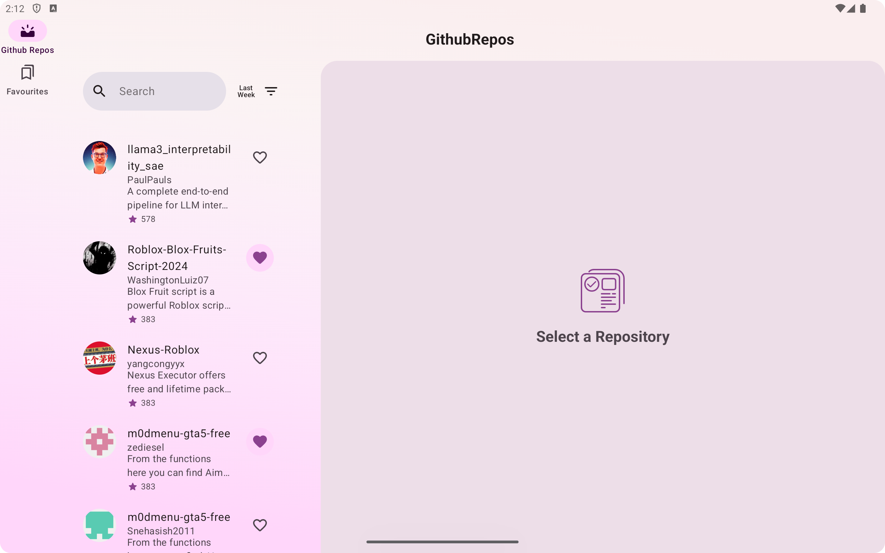
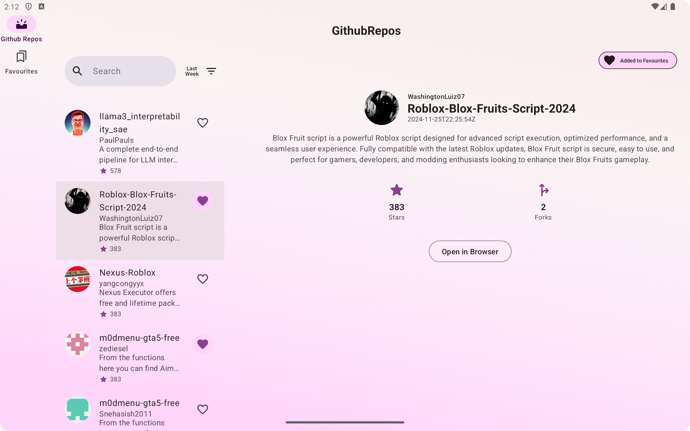

GithubRepos App
==================
This is a Kotlin-based Android application that fetches and displays trending GitHub repositories.
Users can explore repositories based on different timeframes (last day, last week, last month), view
repository details, and manage a favorite list of repositories. The app ensures an optimized and
user-friendly experience.

# Features

### Core Features

1. **Trending Repositories List:**
    - Displays repositories created in the last day, week, or month.
    - Sorted by the number of stars.
    - Search by repository name or description.
    - Add/Remove favorite from the list.

2. **Repository Detail Screen:**
    - Owner's avatar (or a default placeholder if unavailable).
    - Owner's username and repository name.
    - Creation date.
    - Repository description (or default text if not provided).
    - Number of stars.
    - Number of forks.
    - Language (if available).
    - Open in browser button.
    - Add/Remove favorite button.

3. **Favorite Repositories:**
    - Displays a list of favorited repositories.
    - Search by repository name or description.
    - Add/Remove favorite from the list.
    - View favorites in a separate screen, even offline.

### Additional Features

- **Infinite Scrolling:** Fetches more repositories when the user nears the end of the list.
- **Image Caching:** Optimized avatar loading using Coil library.
- **Offline Support:** Favorites are saved locally for offline access.
- **Search Functionality:** Search for repositories within the list.
- **Adaptive Layouts:** Optimized UI for both phones and tablets.
- **No Internet Handling:** Provides a Snackbar when the device is offline.
- **State Handling:** Loading, Error, and Empty states are handled gracefully.

## Screenshots

  
  
  

  
  

  

  

## Technical Details

### Tech Stack

- **Language:** Kotlin
- **Modularization:** Multi-module structure for scalability and maintainability.
- **Architecture:** Follows
  the [official architecture guidance](https://developer.android.com/topic/architecture), and
  follows a reactive programming model
  with [unidirectional data flow](https://developer.android.com/topic/architecture/ui-layer#udf).
- **Dependency Injection:** Hilt for DI management.
- **Networking:** Retrofit with Kotlin Coroutines for API calls.
- **Persistence:** Room for storing favorite repositories.
- **Image Loading:** Coil for efficient and optimized image loading.
- **Paging:** Paging Library for handling infinite scrolling.
- **ViewModels:** Jetpack ViewModels to manage UI-related data lifecycle-aware.
- **Compose:** Jetpack Compose for modern, declarative UI.
- **Adaptive Layouts:** Responsive design for tablets and phones.
- **Kotlin Coroutines:** For asynchronous programming.
- **Repositories:** Abstraction layer for handling data sources.
- **Convention Plugins:** To enforce consistent build configurations.
- **Versions Catalog:** Centralized dependency management.
- **UI:** The app was designed using [Material 3 guidelines](https://m3.material.io/)